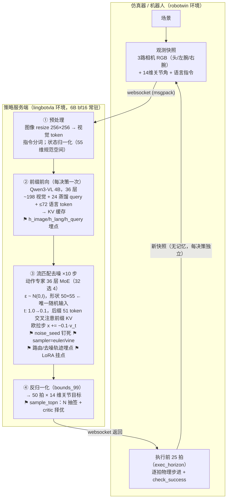
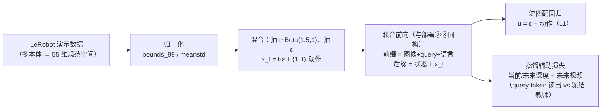

# LingBot-VLA 2.0 完整流程（部署闭环 + 训练）

以本项目实测/代码确认为准（`lingbot_patch/` 所改动的上游代码即此流程的实现）。
图中 ⚑ 标注为本项目加入的扩展点。

## 部署闭环（每个决策）

- 一集 ≈ 4–12 个决策（快任务），直至成功或步数上限。
- 时延：官方 `--use_compile` ≈130ms/决策；本项目埋点配置（无 compile）≈0.5s。
- 策略**无记忆**：不看历史决策、不核对执行结果；每决策独立抽 ε。

## 训练流程（一次性，产出部署所用权重）

**要点**：成败信号不参与训练的任何环节（模仿学习）——这是本项目全部
负结果（RL 梯度、择优、定向抽签）的总根源；query token 的深度/动力学读出
在部署时是免费副产，被本项目用作状态特征。

## 本项目扩展点索引

| 扩展点 | 位置 | 用途 |
|---|---|---|
| introspect 埋点 | ②③ | 前缀读出、MoE 路由计数/熵、噪声、去噪轨迹 |
| noise_seed | ③ | 决策级噪声钉死（可复现/配对实验） |
| sampler=vine | ③ | VINE 终点预测采样器（arXiv 2607.10369） |
| --lora_path | ③ | 动作专家 LoRA 加载（RL 微调产物） |
| --critic_path + sample_topn | ④ | N 抽签 + 冻结裁判择优 |
| routing_bias | ③ | 路由分数定向偏置（阶段一矫正实验） |
